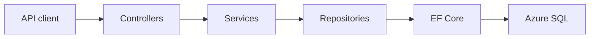

# Deploying a Clinic Intake API to Azure

I built the Clinic Intake API to explore how a backend service can support a clinic intake workflow while protecting clinic-scoped data. The finished project is a deployed .NET 8 REST API with authentication, validation, automated tests, health checks, and a GitHub Actions deployment pipeline.

**Project links**

- [Repository](https://github.com/DianeLarsen/clinic-intake-api)
- [Live readiness check](https://clinic-intake-api-dlarsen-2026-dhdmdmesgkgygpbz.westus-01.azurewebsites.net/health/ready)

## The problem

I chose a clinic intake workflow because it gave the API meaningful constraints beyond basic create, read, update, and delete operations. I also chose this domain because it aligns with my Master’s in Health Informatics and lets me practice backend engineering decisions in a healthcare-related context. The API models registered patients and intake requests, with requests associated with a specific clinic. In a real multi-clinic system, records must stay scoped to the authenticated clinic so one clinic cannot access another clinic’s data.

The primary goal of this project was to learn how to build and deploy a .NET backend API to Azure. I wanted to practice the engineering work around an endpoint—not just the endpoint itself—including authentication and authorization, validation, database migrations, structured logging, automated tests, CI/CD, and health checks. This is a learning project, not a production clinical system, but the clinic scenario gave me a practical way to make and test those engineering decisions.

## What I built

- Versioned REST endpoints for patients and intake requests
- JWT authentication with Admin and User roles
- Clinic-level data isolation using the `ClinicId` claim
- Validation, filtering, sorting, search, pagination, and request status updates
- Structured logging, centralized error handling, and trace IDs
- Liveness and readiness health checks
- 47 unit and integration tests
- Continuous integration and deployment through GitHub Actions

## Architecture

The API follows a layered design so each part has a clear responsibility:

A request enters the API through a controller, which handles the HTTP request and applies authorization rules. The controller passes the work to a service, where the application’s business rules are enforced, such as validating the request and ensuring the authenticated user can access only records for their clinic. The service then uses a repository to retrieve or update data through Entity Framework Core.

I used SQLite for local development and automated tests because it is lightweight and easy to create and reset. For the deployed application, I used SQL Server through Azure SQL Database so the API could run with a managed cloud database. Using both providers also taught me that code which works locally can still expose database-specific issues during deployment.

## Protecting clinic data

A major risk in a multi-clinic API is unauthorized access to another clinic’s records. A user should only be able to view or update patients and intake requests that belong to their own clinic. Simply requiring a user to be signed in is not enough; the API also has to enforce which clinic’s data that user is allowed to access.

To enforce that boundary, I derive the ClinicId from the validated JWT rather than accepting a clinic identifier from the request. That clinic scope is carried through the controller, service, and repository layers so database queries only return records that belong to the authenticated user’s clinic. When a user attempts to access a record from another clinic, the API returns 404 Not Found. I added authorization and integration tests to verify that cross-clinic records cannot be retrieved.

## Deploying to Azure

The production application runs on Azure App Service (Linux) with Azure SQL Database. GitHub Actions builds and tests changes from `main`, then deploys the application using OIDC authentication rather than a stored publish-profile secret.

Moving from local development to Azure showed me that a successful local build is only the starting point. SQLite made development and tests fast, but Azure SQL uses SQL Server behavior and exposed database rules that were not apparent locally. I also learned that deployment involves more than publishing an application: connection settings, database migrations, authentication between GitHub Actions and Azure, startup reliability, and health checks all have to work together. Verifying the deployed readiness endpoint gave me a concrete way to confirm the API and database were working after deployment.

## Debugging a SQL Server migration failure

During my first Azure deployment, the application could not complete its database migration because Azure SQL rejected part of the schema. The migration used cascading delete relationships that SQL Server identified as creating multiple cascade paths. That meant deleting one record could potentially cause SQL Server to reach related records through more than one cascade route, so it blocked the migration rather than risking ambiguous delete behavior.

I checked the deployment logs and read the SQL Server error to identify which migration and relationship were failing. I updated the relationship’s delete behavior so the database no longer had conflicting cascade paths, then redeployed the API. When the migration completed and the /health/ready endpoint returned 200 Healthy, it confirmed that the application could connect to Azure SQL and complete its startup checks successfully.

## Testing, observability, and deployment verification

The project includes 47 unit and integration tests using xUnit, Moq, and WebApplicationFactory. These tests verify API behavior, validation, and authorization rules—including clinic-scoped access.

I also added structured logging, centralized exception handling, and trace IDs so failures are easier to investigate. After deployment, I verify application status with liveness and readiness endpoints.

## What I learned

- Local development and production databases can behave differently. SQLite made it easy to develop and run tests, but moving to SQL Server/Azure SQL exposed database-specific rules, including the multiple cascade paths issue in my migration.
- Authentication is not enough by itself. I learned that clinic-level authorization has to be enforced through the data-access path by using the `ClinicId` from the validated JWT in controller, service, and repository logic.
- Tests and health checks provide different kinds of evidence. The automated test suite verifies expected behavior before deployment, while the readiness endpoint verifies that the deployed application can start and connect to its database successfully.

## What I would improve next

Release 1.0 is complete and deployed. The following are future learning extensions rather than missing requirements:

- Add deeper Application Insights queries and dashboards to practice investigating production-style telemetry.
- Containerize the API with Docker to learn a more portable deployment approach.
- Explore background processing and Azure Service Bus for workflows that should not block an API request.

## Closing

This project gave me hands-on experience building, testing, debugging, and deploying a backend API from local development through Azure App Service and Azure SQL. It also let me apply my interest in healthcare technology and Health Informatics to a realistic data-access scenario while strengthening the backend engineering skills I want to use in future software roles.